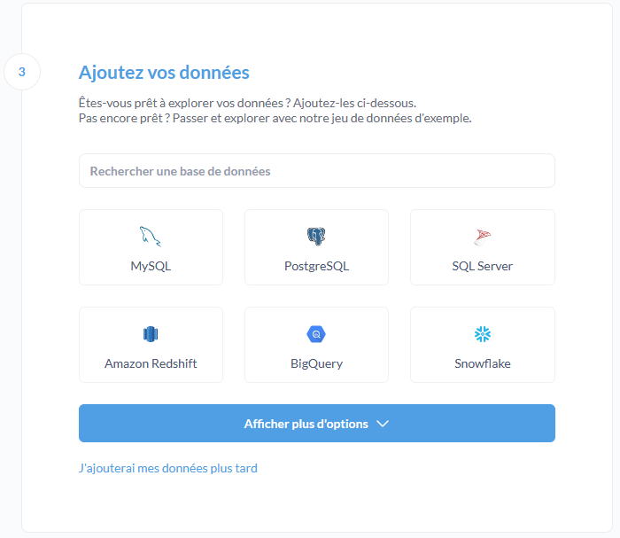

# Journal de Mon Portail NIS 2

Ce dépôt Git représente le journal des événements métiers 
survenus dans [Mon Portail NIS 2](https://github.com/betagouv/anssi-nis2).

Ces événements métiers ont vocation à être utilisés par la 
partie _reporting_ de Mon Portail NIS 2.

C'est [Metabase](https://www.metabase.com/), hébergé chez Scalingo, qui a été choisi 
comme outil de _reporting_.

## Configuration de l'environnement de développement

### Prérequis

Il est nécessaire en prérequis d'avoir installé [Git](https://git-scm.com/),
[Docker Engine](https://docs.docker.com/get-docker/) et [Docker Compose](https://docs.docker.com/compose/install/).

### Récupération du dépot 

Commencer par récupérer les sources du projet et aller dans le répertoire créé.

```sh
git clone https://github.com/betagouv/anssi-nis2-journal.git && cd anssi-nis2-journal
```

### Lancement et création de la base de données

Créer la base de données `nis2-journal` et un utilisateur `metabase` 
qui sera utilisé par Metabase.

```sh
docker compose up nis2-journal-db
docker compose exec nis2-journal-db createdb -U postgres nis2-journal
docker compose exec nis2-journal-db createuser -U postgres metabase
```

Lancer la migration:

```sh
docker compose up node
```

### Configuration de l'environnement

Créer un fichier `.env` en vous basant sur `.env.template` afin de créer les variables d'environnement nécessaires

### Lancement de metabase 

Lancer metabase:

```sh
docker compose up metabase
```

#### Configuration au premier lancement

Aller sur [http://localhost:3000/]()





